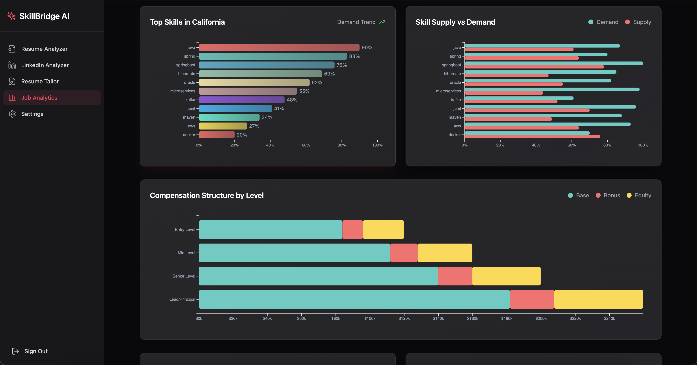
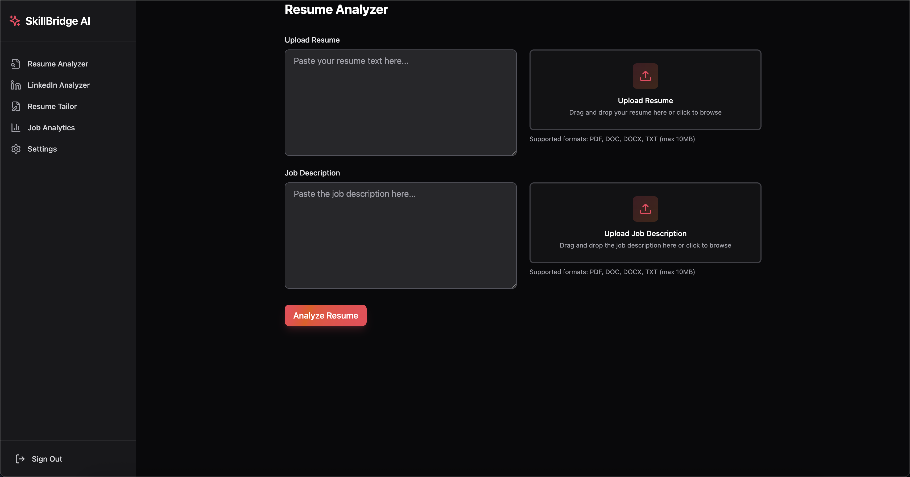
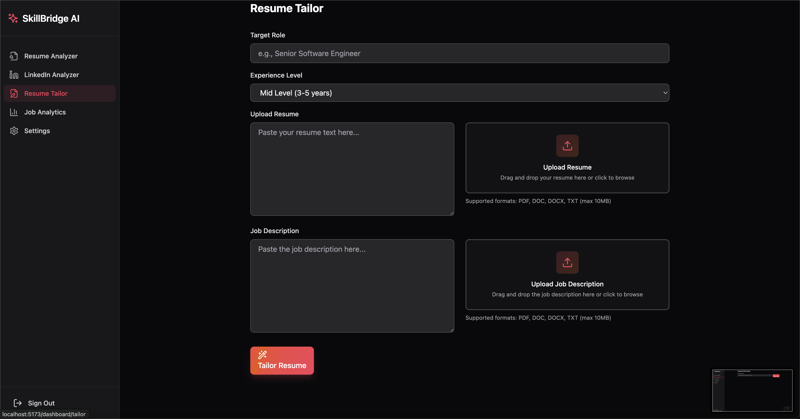

# SkillBridge AI

A modern web application built to help users enhance their skills and connect with opportunities.

## Overview

SkillBridge AI is a React-based web application that provides users with a personalized dashboard to track their skill development, connect with opportunities, and visualize their progress through interactive data visualizations.

## Features

### User Authentication and Profile Management

- Secure user registration and login powered by Supabase Auth
- Profile customization with skill tagging and interest tracking
- Password recovery and account management
- Role-based access control for different user types

### Interactive Dashboard

- Personalized user dashboard with skill tracking metrics
- Progress visualization with interactive charts
- Recommendation engine for skill development opportunities
- Custom widgets for productivity tracking
- Real-time notifications and updates

### Data Visualization

- Interactive skill mapping using D3.js force-directed graphs
- Geographic data visualization with Leaflet maps
- Word clouds for skill trend analysis using D3-cloud
- Time-series data visualization for progress tracking
- Custom SVG animations with Framer Motion integration

### Document Management

- Resume and document parsing with Mammoth.js
- Skill extraction from uploaded documents
- Conversion of various document formats to structured data
- Document version history and comparison

### Mobile Responsiveness

- Adaptive layouts with Tailwind CSS
- Touch-friendly interface for mobile devices
- Progressive enhancement for various screen sizes
- Optimized performance across devices

### Data Management

- Real-time data synchronization with Supabase Realtime
- Optimistic UI updates for immediate feedback
- Offline capability with local storage fallback
- Data export and import functionality

## Tech Stack

- **Frontend**: React, TypeScript, Framer Motion
- **Styling**: Tailwind CSS, CLSX
- **Routing**: React Router
- **Form Handling**: React Hook Form, Zod validation
- **Data Visualization**: D3.js, Leaflet, Topojson
- **Backend/Database**: Supabase
- **Build Tools**: Vite, ESLint, TypeScript
- **Performance**: Web Workers (Comlink)

## APIs and Integrations

### Supabase

- **Authentication**: Complete user authentication flow with email/password, OAuth providers, and magic links
  - JWT token management with secure client-side storage
  - Custom auth hooks with React Context for global auth state
  - Multi-factor authentication implementation
  - Session management with auto-refresh capabilities
- **Database**: PostgreSQL database with Row-Level Security for data protection
  - Real-time subscriptions using Supabase Realtime
  - Optimized query patterns with prepared statements
  - Complex joins for relational data retrieval
  - Multi-tenant data isolation with RLS policies
- **Storage**: File storage for document uploads with access control
  - Content-type validation and file size limits
  - CDN-backed file delivery with presigned URLs
  - Automated image resizing for profile pictures
  - Expiring links for sensitive documents
- **Realtime**: WebSocket-based real-time data synchronization
  - Channel-based subscription model
  - Broadcast and presence channels for collaborative features
  - Custom message filters for targeted updates
  - Reconnection strategies with exponential backoff
- **Edge Functions**: Serverless functions for backend processing
  - Scheduled jobs for data aggregation and reporting
  - Webhook handlers for third-party integrations
  - Custom business logic implementation
  - Environment-specific deployment configurations

### Rapid API Integrations

- **Profile Enrichment API**: Fetches and enriches user profile data with additional metadata
  - Endpoints: `/api/profile/enrich`, `/api/profile/validate`
  - Response caching strategy with 24-hour TTL
  - Rate limiting: 100 requests/minute per API key
  - Custom error handling with fallback responses
  - Payload optimization for minimal data transfer
- **Job Search API**: Real-time job listings and recommendations based on user skills
  - Endpoints: `/api/jobs/search`, `/api/jobs/recommend`, `/api/jobs/trending`
  - Query parameters: location, skills, experience level, salary range
  - Pagination with cursor-based implementation
  - Geolocation-based sorting and filtering
  - Webhook support for saved search alerts
- **Company Data API**: Provides company information and industry insights
  - Endpoints: `/api/companies/profile`, `/api/companies/similar`
  - Data fields: company size, funding status, technologies used, hiring trends
  - Batch request capability (up to 20 companies per request)
  - Industry classification using standard taxonomies
  - Historical data access with time-series endpoints
- **Skill Taxonomy API**: Standardized skill categorization and hierarchy mapping
  - Endpoints: `/api/skills/search`, `/api/skills/related`, `/api/skills/trending`
  - Hierarchical skill classification with parent-child relationships
  - Cross-referencing with industry-standard frameworks
  - Fuzzy matching for skill name variations
  - Confidence scoring for skill identification
- **Market Trends API**: Delivers industry and skill demand trends for career guidance
  - Endpoints: `/api/trends/skills`, `/api/trends/industries`, `/api/trends/locations`
  - Time-series data with customizable date ranges
  - Geographical filtering capabilities
  - Comparison metrics across industries and regions
  - Forecast endpoints with confidence intervals

### OpenRouter AI Integration

- **Gemini 1.5 Flash 8B**: Integration for intelligent skill analysis and recommendations
  - Model parameters: temperature=0.7, top_p=0.9, max_tokens=1024
  - Context window: 8K tokens for comprehensive analysis
  - Specialized prompt templates for skill gap analysis
  - Fine-tuned for career development recommendations
  - Real-time inference for dynamic user interactions
  - Implementation details:
    - REST API integration with `/v1/chat/completions` endpoint
    - Streaming response handling for progressive UI updates
    - Request batching for efficiency (up to 5 requests/batch)
    - Prompt engineering with system messages for domain-specific results
    - JSON mode for structured data extraction
- **Skill extraction and classification**: Automated skill identification from user data
  - Custom NER (Named Entity Recognition) implementation
  - Confidence scoring system (0-100) for extracted skills
  - Integration with skill taxonomy for standardization
  - Contextual skill relevance scoring
- **Personalized learning path generation**: AI-powered custom learning recommendations
  - Multi-step generation process with refinement iterations
  - Learning resource categorization (courses, articles, projects)
  - Difficulty level assessment for progressive learning
  - Time-to-competency estimation for each skill
- **Career trajectory prediction**: Data-driven career pathing suggestions
  - Historical career progression data integration
  - Industry-specific role transition probabilities
  - Salary progression forecasting
  - Required skill acquisition timeline
- **Resume optimization**: Smart suggestions for resume improvements
  - Keyword optimization for ATS compatibility
  - Impact statement reformulation
  - Skills gap highlighting with acquisition suggestions
  - Industry-specific terminology recommendations

### D3.js Integration

- Custom data visualization components
- Interactive charts and graphs
- Data transformation and manipulation
- Animation and transition effects
- Event handling for user interaction

### Leaflet Maps

- Interactive geographic data visualization
- Custom map layers and overlays
- Marker clustering for large datasets
- GeoJSON data integration
- User location tracking and proximity analysis

### Document Processing

- Mammoth.js for DOCX to HTML/text conversion
- Structured data extraction from documents
- Format normalization across different document types
- Content analysis for skill identification

### Web Workers

- Comlink for simplified Web Worker communication
- Background processing for intensive operations
- UI thread offloading for smoother user experience
- Parallel data processing for improved performance

## Getting Started

### Prerequisites

- Node.js (latest LTS version recommended)
- npm or yarn

### Installation

1. Clone the repository

```
git clone <repository-url>
```

2. Install dependencies

```
npm install
```

3. Set up environment variables
   Create a `.env` file in the root directory with the following variables:

```
VITE_SUPABASE_URL=<your-supabase-url>
VITE_SUPABASE_ANON_KEY=<your-supabase-anon-key>
```

4. Start the development server

```
npm run dev
```

## Available Scripts

- `npm run dev` - Start the development server
- `npm run build` - Build the application for production
- `npm run lint` - Run ESLint to check code quality
- `npm run preview` - Preview the production build locally

## Deployment

This project is configured for deployment on Netlify with the included `netlify.toml` configuration file.

## Project Structure

- `/public` - Static assets
  - `/images` - README and documentation images
  - `/icons` - Application icons
  - `/screenshots` - Application screenshots for documentation
- `/src` - Application source code
  - `/components` - React components
  - `/contexts` - React context providers
  - `/lib` - Utility functions and services
  - `/types` - TypeScript type definitions

## Screenshots and Demos

### Dashboard Overview


_Landing page_


_Main dashboard interface showing skill tracking and visualization_

### Data Visualization


_Interactive charts showing skill progression over time_

### LinkedIn Profile Analyzer


_LinkedIn Profile Analyzer_

### Resume Analyzer


_Resume Analyzer_

### Resume Tailor


_Resume Tailor_

## License

[MIT License](LICENSE)

## Acknowledgements

- This project uses various open-source libraries and tools that make modern web development possible.
